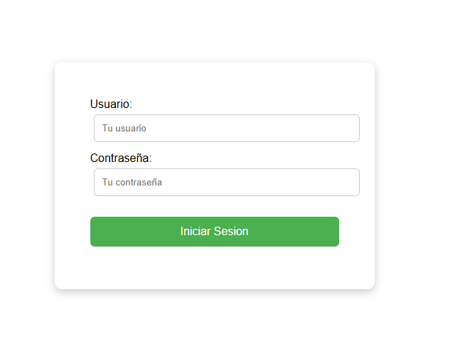
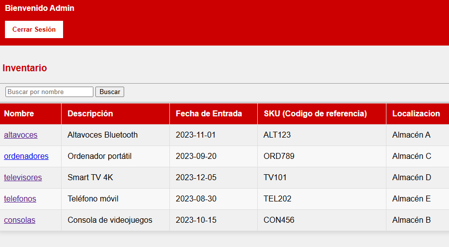
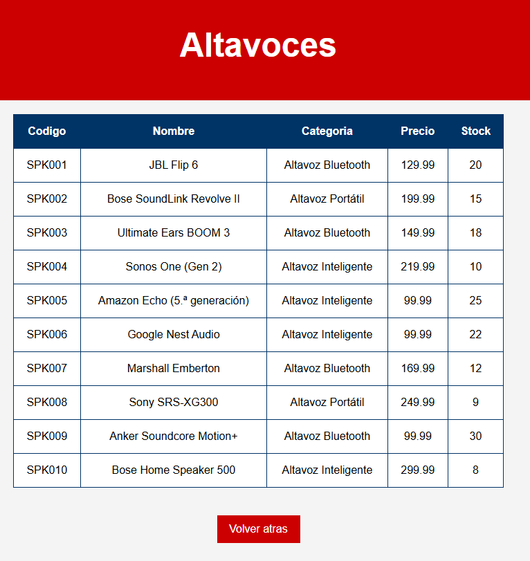
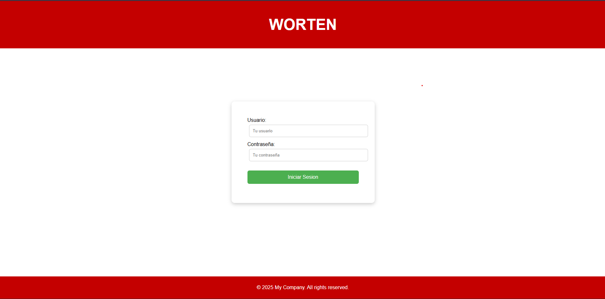
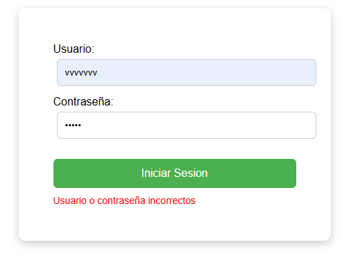
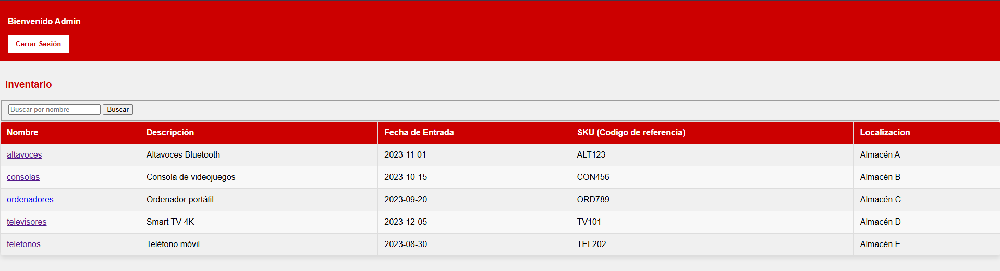
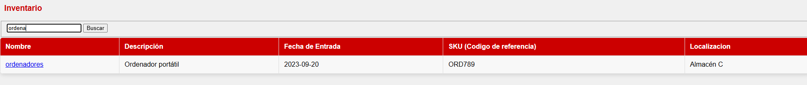
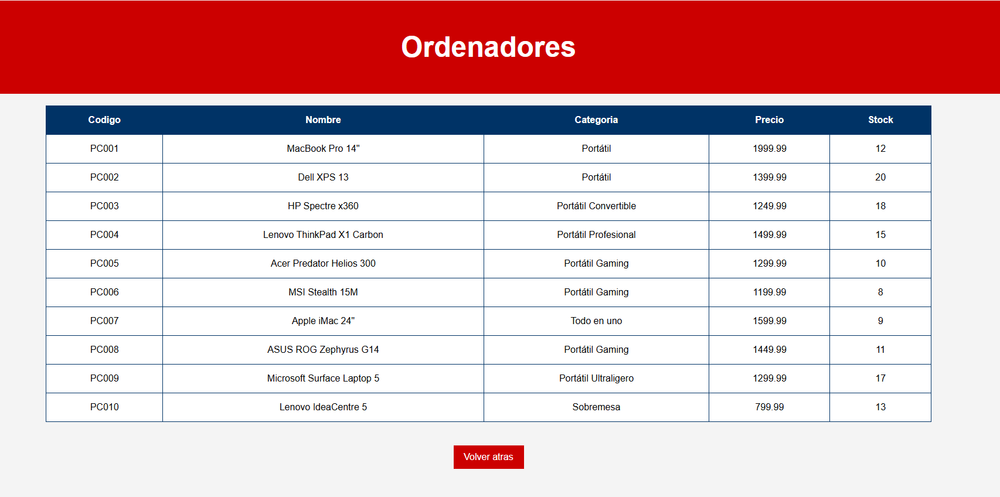

# Proyecto-Visualizar-XML-en-la-Web.
Crear una página web que permita: Listar todos los archivos XML disponibles en un directorio. y que al hacer clic en el nombre de un archivo XML, cargarlo en la página.

## Material usado

 - Firebase
 - Gemini

## Estructura de carpetas:
```
Carpeta Proyecto
|- Carpeta con HTML (páginas)
|- Carpeta con CSS (estilos)
|- Carpeta con JavaScript (scripts)
|- Carpeta con xml (data)
```
## Elementos necesarios para su uso
Opciones para el funcionamiento correcto de las páginas

### Desde VisualStudioCode
 - Extensión LiveServer
### Desde Navegador
 - Flag  --allow-file-access-from-files en el acceso directo

## Estructura de funcionamiento:


1 Validación de entrada a la web (similar a lo que haria un empleado de una tienda de informática). Usuario y contraseña




2 Página de visualización de los xml en una lista. Botones para cerrar sesión o incluso busquedas en la lista de xml según nombre (filtro)




3 Información del xml por productos. Boton para volver al html inicial.




## Ejemplo de uso

Basandonos en una aplicación real, al preguntarle al empleado de una tienda por un producto visto en la web, este abre una aplicación
que lo primero que le pide es un usuario y contraseña. Asi nosotros lo hemos simulado también:



En esta ocasión y por simplificar nuestro usuario será: admin y contraseña: 1234. 
El login también comprueba que es correctos los datos



Una vez puestos los datos correctos, se nos presenta una ventana que contiene una tabla con los datos básicos del inventario.



Supongamos que tenemos más archivos y solo queremos ver "ordenadores". Para ello, en el campo de busqueda usaremos el nombre para filtrar



Encontrado el archivo que queremos ver, clickaremos encima del nombre, abriendose en la pestaña la información de los productos.
Si queremos abandonar esta sección usaremos el boton "Volver atras".




## Autores:

Yanira Gutiérrez García  
Daniel Ramos Montoya


